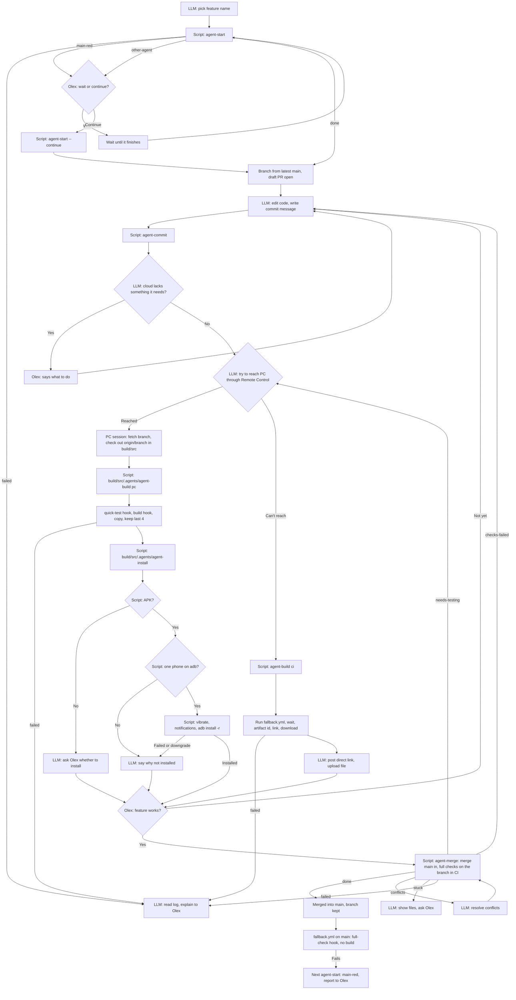

# Agent pipeline

Diagram of the steps in the shared rules at the top of `AGENTS.md`. The rules are the source of truth; update this diagram when they change.

```mermaid
graph TD
    A[LLM: pick feature name] --> B[Script: agent-start]
    B -->|failed| ERR[LLM: read log, explain to Olex]
    B -->|main-red| ASK
    B -->|other-agent| ASK{Olex: wait or continue?}
    ASK -->|Wait| WAIT[Wait until it finishes]
    WAIT --> B
    ASK -->|Continue| CONT[Script: agent-start --continue]
    CONT --> START
    B -->|done| START[Branch from latest main, draft PR open]
    START --> EDIT[LLM: edit code, write commit message]
    EDIT --> COMMIT[Script: agent-commit]
    COMMIT --> MISS{LLM: cloud lacks something it needs?}
    MISS -->|Yes| ASKM[Olex: says what to do]
    ASKM --> EDIT
    MISS -->|No| RC{LLM: try to reach PC through Remote Control}
    RC -->|Reached| FETCH[PC session: fetch branch, check out origin/branch in build/src]
    FETCH --> PC[Script: build/src/.agents/agent-build pc]
    RC -->|Can't reach| CI[Script: agent-build ci]
    PC --> PCS[quick-test hook, build hook, copy, keep last 4]
    PCS -->|failed| ERR
    PCS --> INSTALL[Script: build/src/.agents/agent-install]
    INSTALL --> APK{Script: APK?}
    APK -->|No| ASKI[LLM: ask Olex whether to install]
    APK -->|Yes| PH{Script: one phone on adb?}
    PH -->|No| WHY[LLM: say why not installed]
    PH -->|Yes| INST[Script: vibrate, notifications, adb install -r]
    INST -->|Failed or downgrade| WHY
    CI --> CIS[Run fallback.yml, wait, artifact id, link, download]
    CIS -->|failed| ERR
    CIS --> UP[LLM: post direct link, upload file]
    ASKI --> OK
    WHY --> OK
    INST -->|Installed| OK
    UP --> OK
    OK{Olex: feature works?} -->|Not yet| EDIT
    OK -->|Yes| M[Script: agent-merge: merge main in, full checks on the branch in CI]
    M -->|done| DONE[Merged into main, branch kept]
    M -->|conflicts| FIX[LLM: resolve conflicts]
    FIX --> M
    M -->|needs-testing| RC
    M -->|checks-failed| EDIT
    M -->|stuck| STUCK[LLM: show files, ask Olex]
    M -->|failed| ERR
    DONE --> FULL[fallback.yml on main: full-check hook, no build]
    FULL -->|Fails| REP[Next agent-start: main-red, report to Olex]
```
